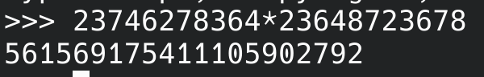
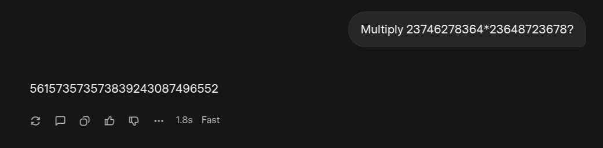
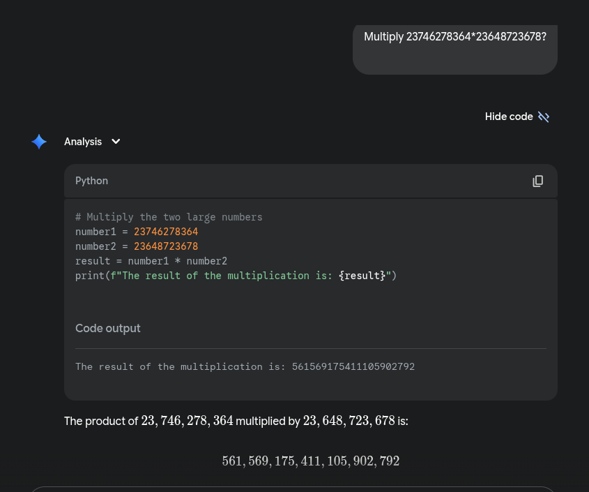
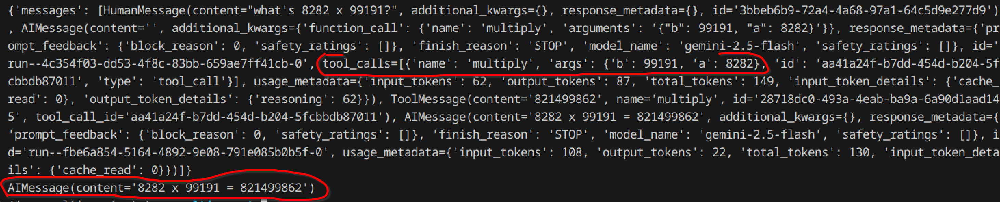

# Multiplication tool

## Question

- Multiply 23746278364 * 23648723678 ?

## Actual Answer

## Grok response

- Grok didn’t use any tool for calculation so, the response was incorrect because LLM can't handle complex calculation.

## Gemini response

- It use python as a tool/calculator so, that it can handle complex calculation.

**I realized the importance of tools in LLM after watching “How I use LLMs” video from Andrej Karpathy.**
- [How I use LLMs](https://www.youtube.com/watch?v=EWvNQjAaOHw)

I wanted to build similar project where tools are integrated with LLM to handle situation where LLM hallucinate.

## Input
what's 8282 x 99191?

## Output

Below we can see that LLM has used tool for calculation with correct output

I was able to make my custom tool and integrate with LLM model by following this documentation.

- [Resource](https://langchain-ai.github.io/langgraph/how-tos/tool-calling/)

To learn more about **how tool calling happens?** click below link.
- [Link](https://langchain-ai.github.io/langgraph/concepts/tools/#tool-calling)
